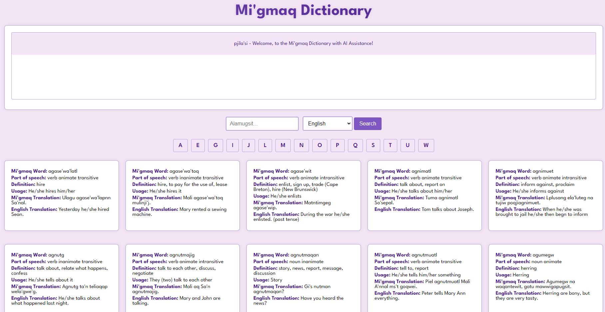

Project Name
Migmaq_Foundation

Description:
The Migmag Foundation Dictionary is a web application designed to provide a comprehensive dictionary for the Mi'gmag language. It allows users to search for words, view their definitions, types, and translations, and supports filtering by various criteria.

With additon of a "fact" bot



## Getting Started

```
nodemon server.js
```

You can access the website at http://localhost:3000/

### Auto restart server

```
npm i -g nodemon
nodemon server.js
```

### TO DO

- Fuzzy Search Feature.
- Image Generator (Open AI) ?
